# Architecture and State Flow Documentation

> **Latchz MDM** — A self-hosted Windows Mobile Device Management server built in Go with a React frontend. This document captures the system architecture, data flows, state machines, and component interactions.

---

## Table of Contents

1. [System Overview](#1-system-overview)
2. [Architecture Diagram](#2-architecture-diagram)
3. [Component Layers](#3-component-layers)
4. [Deployment Topology](#4-deployment-topology)
5. [Protocol Flows](#5-protocol-flows)
   - 5.1 Device Enrollment Flow (MS-MDE2)
   - 5.2 OMA-DM SyncML Check-in Flow
   - 5.3 Policy Compilation (DDF Compiler)
   - 5.4 Policy Assignment & Enforcement
6. [Authentication & Authorization](#6-authentication--authorization)
7. [State Machines](#7-state-machines)
8. [Data Model](#8-data-model)
9. [API Surface](#9-api-surface)
10. [Session Management](#10-session-management)

---

## 1. System Overview

Latchz MDM is a **single Go binary** (`latchz` or `ddf-compiler`) that serves three distinct roles:

| Role | Protocol | Port | Description |
|------|----------|------|-------------|
| **MDM Server** | OMA-DM / MS-MDE2 / WSTEP / XCEP | 443 (mTLS) | Manages enrolled Windows devices |
| **Admin Web API** | REST + OIDC + HTML | 443 (TLS) | Dashboard for managing devices, profiles, groups |
| **DDF Compiler** | CLI tool | N/A | Ingests Microsoft DDF XML into the policy catalog |

The system uses a **relational database** (PostgreSQL or SQLite) as the central state store, with **in-memory session storage** for active device sessions.

---

## 2. Architecture Diagram

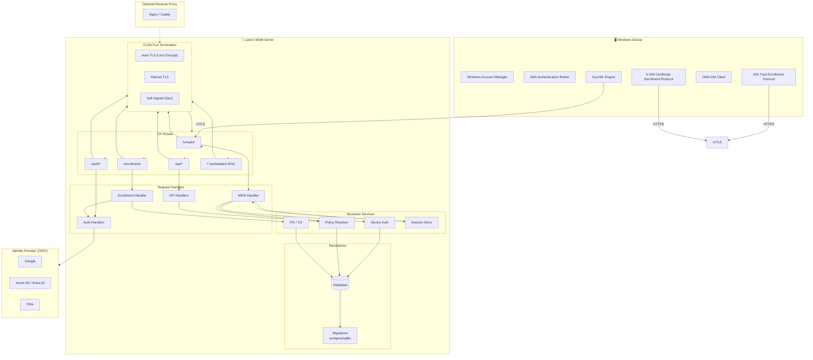
```mermaid
graph TB
    subgraph Client["🖥️ Windows Device"]
        WAM[Windows Account Manager]
        WAB[Web Authentication Broker]
        WSTEP[WS-Trust Enrollment Protocol]
        XCEP[X.509 Certificate Enrollment Protocol]
        DM[OMA-DM Client]
        SYNC[SyncML Engine]
    end

    subgraph Server["🔷 Latchz MDM Server"]
        subgraph TLS["TLS/mTLS Termination"]
            AUTO["Auto-TLS (Let's Encrypt)"]
            MANUAL["Manual TLS"]
            SELF["Self-Signed (Dev)"]
        end

        subgraph Router["Chi Router"]
            OMADM["/omadm"]
            ENROLL["/enrollment/"]
            AUTH["/auth/*"]
            API["/api/*"]
            WEB["/* (embedded SPA)"]
        end

        subgraph Handlers["Request Handlers"]
            MDM["MDM Handler"]
            ENR["Enrollment Handler"]
            API_H["API Handlers"]
            AUTH_H["Auth Handlers"]
        end

        subgraph Services["Business Services"]
            DEV_AUTH["Device Auth"]
            POLICY["Policy Resolver"]
            PKI["PKI / CA"]
            SESSION["Session Store"]
        end

        subgraph Data["Persistence"]
            DB[(Database)]
            MIGR["Migrations<br/>postgres/sqlite"]
        end
    end

    subgraph IdP["Identity Provider (OIDC)"]
        GOOGLE["Google"]
        AZURE["Azure AD / Entra ID"]
        OKTA["Okta"]
    end

    subgraph Proxy["Optional Reverse Proxy"]
        NGINX["Nginx / Caddy"]
    end

    WSTEP -->|HTTPS|mTLS
    XCEP -->|HTTPS|mTLS
    SYNC -->|mTLS| OMADM
    OMADM --> TLS
    ENROLL --> TLS
    AUTH --> TLS
    API --> TLS
    WEB --> TLS

    TLS --> Router
    Router --> OMADM
    Router --> ENROLL
    Router --> AUTH
    Router --> API
    Router --> WEB

    OMADM --> MDM
    ENROLL --> ENR
    AUTH --> AUTH_H
    API --> API_H

    MDM --> DEV_AUTH
    MDM --> SESSION
    MDM --> POLICY

    ENR --> PKI
    ENR --> AUTH_H

    AUTH_H --> IdP
    API_H --> POLICY

    DEV_AUTH --> DB
    POLICY --> DB
    PKI --> DB
    SESSION -.-> MDM

    DB --> MIGR

    Proxy -.-> TLS
```

---

## 3. Component Layers

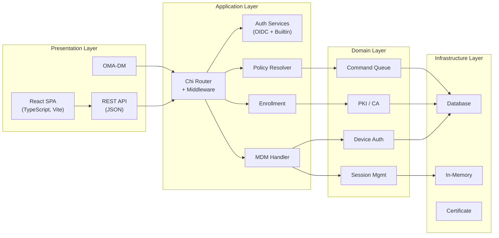
```mermaid
graph LR
    subgraph "Presentation Layer"
        WEB_UI["React SPA<br/>(TypeScript, Vite)"]
        REST_API["REST API<br/>(JSON)"]
        OMA_DM["OMA-DM<br/](XML/SyncML)"]
    end

    subgraph "Application Layer"
        ROUTER["Chi Router<br/>+ Middleware"]
        AUTH_SVC["Auth Services<br/>(OIDC + Builtin)"]
        MDM_SVC["MDM Handler<br/](SyncML)"]
        ENROLL_SVC["Enrollment<br/](MS-MDE2)"]
        POLICY_SVC["Policy Resolver"]
    end

    subgraph "Domain Layer"
        DEV_AUTH["Device Auth<br/](devauth)"]
        PKI_SVC["PKI / CA<br/](pki)"]
        SESSION_SVC["Session Mgmt<br/](mdm.Session)"]
        CMD_QUEUE["Command Queue"]
    end

    subgraph "Infrastructure Layer"
        DB_MIGR["Database<br/](sqlx + migrations)"]
        CACHE["In-Memory<br/](sync.Map)"]
        CERT_FS["Certificate<br/](on-disk cache)"]
    end

    WEB_UI --> REST_API
    REST_API --> ROUTER
    OMA_DM --> ROUTER

    ROUTER --> AUTH_SVC
    ROUTER --> MDM_SVC
    ROUTER --> ENROLL_SVC
    ROUTER --> POLICY_SVC

    MDM_SVC --> DEV_AUTH
    MDM_SVC --> SESSION_SVC
    ENROLL_SVC --> PKI_SVC
    POLICY_SVC --> CMD_QUEUE

    DEV_AUTH --> DB_MIGR
    PKI_SVC --> DB_MIGR
    SESSION_SVC --> CACHE
    CMD_QUEUE --> DB_MIGR
```

---

## 4. Deployment Topology

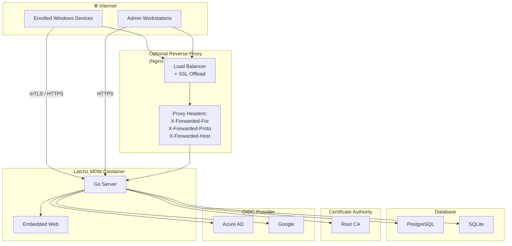
```mermaid
graph TB
    subgraph Internet["🌐 Internet"]
        Devices["Enrolled Windows Devices"]
        Admins["Admin Workstations"]
    end

    subgraph Proxy["Optional Reverse Proxy<br/>(Nginx / Caddy)"]
        LB["Load Balancer<br/>+ SSL Offload"]
        PROXY_CFG["Proxy Headers:<br/>X-Forwarded-For<br/>X-Forwarded-Proto<br/>X-Forwarded-Host"]
    end

    subgraph App["Latchz MDM Container"]
        GO["Go Server<br/](single process)"]
        WEB_DIST["Embedded Web<br/](go:embed)"]
    end

    subgraph DB_["Database"]
        PG["PostgreSQL"]
        SQ["SQLite<br/](single-file)"]
    end

    subgraph CA["Certificate Authority"]
        ROOT_CA["Root CA<br/](in DB, encrypted)"]
    end

    subgraph IdP["OIDC Provider"]
        AZURE_AD["Azure AD"]
        GOOGLE["Google"]
    end

    Devices -->|mTLS / HTTPS| GO
    Admins -->|HTTPS| GO

    Devices --> LB
    Admins --> LB
    LB --> PROXY_CFG --> GO

    GO --> WEB_DIST
    GO --> PG
    GO --> SQ
    GO --> ROOT_CA
    GO --> AZURE_AD
    GO --> GOOGLE
```

---

## 5. Protocol Flows

### 5.1 Device Enrollment Flow (MS-MDE2)

The enrollment flow uses Microsoft's **Modern Device Enrollment (MS-MDE2)** protocol, which combines several sub-protocols:

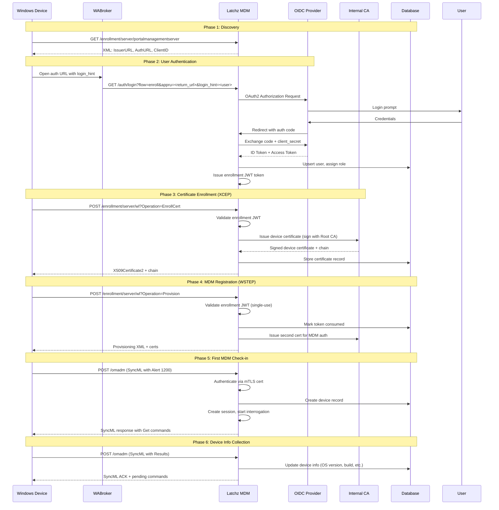
```mermaid
sequenceDiagram
    participant D as Windows Device
    participant WAB as WABroker
    participant S as Latchz MDM
    participant IdP as OIDC Provider
    participant PKI as Internal CA
    participant DB as Database

    Note over D, DB: Phase 1: Discovery
    D->>S: GET /enrollment/server/portalmanagementserver
    S-->>D: XML: IssuerURL, AuthURL, ClientID

    Note over D, IdP: Phase 2: User Authentication
    D->>WAB: Open auth URL with login_hint
    WAB->>S: GET /auth/login?flow=enroll&appru=<return_url>&login_hint=<user>
    S->>IdP: OAuth2 Authorization Request
    IdP->>User: Login prompt
    User->>IdP: Credentials
    IdP->>S: Redirect with auth code
    S->>IdP: Exchange code + client_secret
    IdP-->>S: ID Token + Access Token
    S->>DB: Upsert user, assign role
    S->>S: Issue enrollment JWT token

    Note over D, PKI: Phase 3: Certificate Enrollment (XCEP)
    D->>S: POST /enrollment/server/wl?Operation=EnrollCert
    S->>S: Validate enrollment JWT
    S->>PKI: Issue device certificate (sign with Root CA)
    PKI-->>S: Signed device certificate + chain
    S->>DB: Store certificate record
    S-->>D: X509Certificate2 + chain

    Note over D, DB: Phase 4: MDM Registration (WSTEP)
    D->>S: POST /enrollment/server/wl?Operation=Provision
    S->>S: Validate enrollment JWT (single-use)
    S->>DB: Mark token consumed
    S->>PKI: Issue second cert for MDM auth
    S-->>D: Provisioning XML + certs

    Note over D, DB: Phase 5: First MDM Check-in
    D->>S: POST /omadm (SyncML with Alert 1200)
    S->>S: Authenticate via mTLS cert
    S->>DB: Create device record
    S->>S: Create session, start interrogation
    S-->>D: SyncML response with Get commands

    Note over D, DB: Phase 6: Device Info Collection
    D->>S: POST /omadm (SyncML with Results)
    S->>DB: Update device info (OS version, build, etc.)
    S-->>D: SyncML ACK + pending commands
```

### 5.2 OMA-DM SyncML Check-in Flow

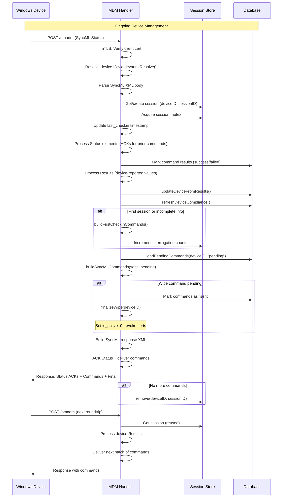
```mermaid
sequenceDiagram
    participant D as Windows Device
    participant H as MDM Handler
    participant SS as Session Store
    participant DB as Database

    Note over D,DB: Ongoing Device Management

    D->>H: POST /omadm (SyncML Status)
    H->>H: mTLS: Verify client cert
    H->>H: Resolve device ID via devauth.Resolve()
    H->>H: Parse SyncML XML body
    H->>SS: Get/create session (deviceID, sessionID)
    H->>SS: Acquire session mutex

    H->>H: Update last_checkin timestamp
    H->>H: Process Status elements (ACKs for prior commands)
    H->>DB: Mark command results (success/failed)

    H->>H: Process Results (device-reported values)
    H->>DB: updateDeviceFromResults()
    H->>DB: refreshDeviceCompliance()

    alt First session or incomplete info
        H->>H: buildFirstCheckInCommands()
        H->>SS: Increment interrogation counter
    end

    H->>DB: loadPendingCommands(deviceID, "pending")
    H->>H: buildSyncMLCommands(sess, pending)

    alt Wipe command pending
        H->>DB: Mark commands as "sent"
        H->>H: finalizeWipe(deviceID)
        Note over H: Set is_active=0, revoke certs
    end

    H->>H: Build SyncML response XML
    H->>H: ACK Status + deliver commands
    H-->>D: Response: Status ACKs + Commands + Final

    alt No more commands
        H->>SS: remove(deviceID, sessionID)
    end

    D->>H: POST /omadm (next roundtrip)
    H->>SS: Get session (reused)
    H->>H: Process device Results
    H->>H: Deliver next batch of commands
    H-->>D: Response with commands
```

### 5.3 Policy Compilation (DDF Compiler)

The DDF compiler is a **separate CLI binary** that ingests Microsoft's Device Description Framework (DDF) XML files into the policy catalog:

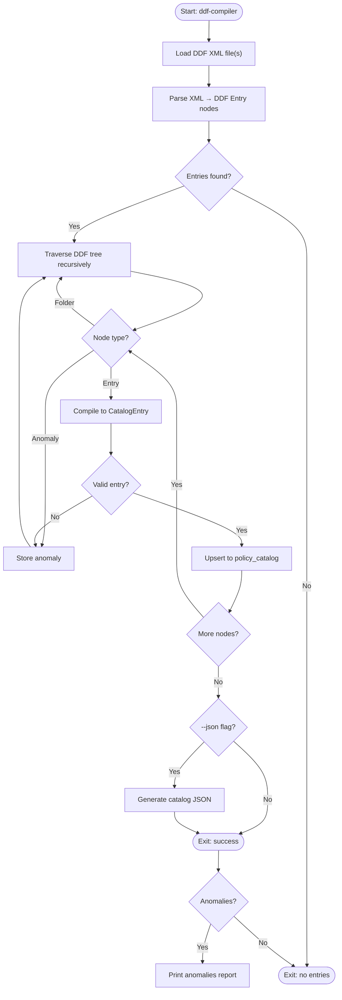
```mermaid
flowchart TD
    Start(["Start: ddf-compiler"]) --> Load["Load DDF XML file(s)"]

    Load --> Parse["Parse XML → DDF Entry nodes"]

    Parse --> Entries{"Entries found?"}
    Entries -->|Yes| Traverse["Traverse DDF tree recursively"]
    Entries -->|No| End(["Exit: no entries"])

    Traverse --> Node{"Node type?"}
    Node -->|Entry| Compile["Compile to CatalogEntry"]
    Node -->|Folder| Traverse
    Node -->|Anomaly| Store["Store anomaly"]

    Compile --> Validate{Valid entry?}
    Validate -->|No| Store
    Validate -->|Yes| Upsert["Upsert to policy_catalog"]

    Store --> Traverse

    Upsert --> More{"More nodes?"}
    More -->|Yes| Node
    More -->|No| JSON{"--json flag?"}

    JSON -->|Yes| GenJSON["Generate catalog JSON"]
    JSON -->|No| Done

    GenJSON --> Done(["Exit: success"])
    Done --> Anomaly{"Anomalies?"}
    Anomaly -->|Yes| Report["Print anomalies report"]
    Anomaly -->|No| End
```

### 5.4 Policy Assignment & Enforcement

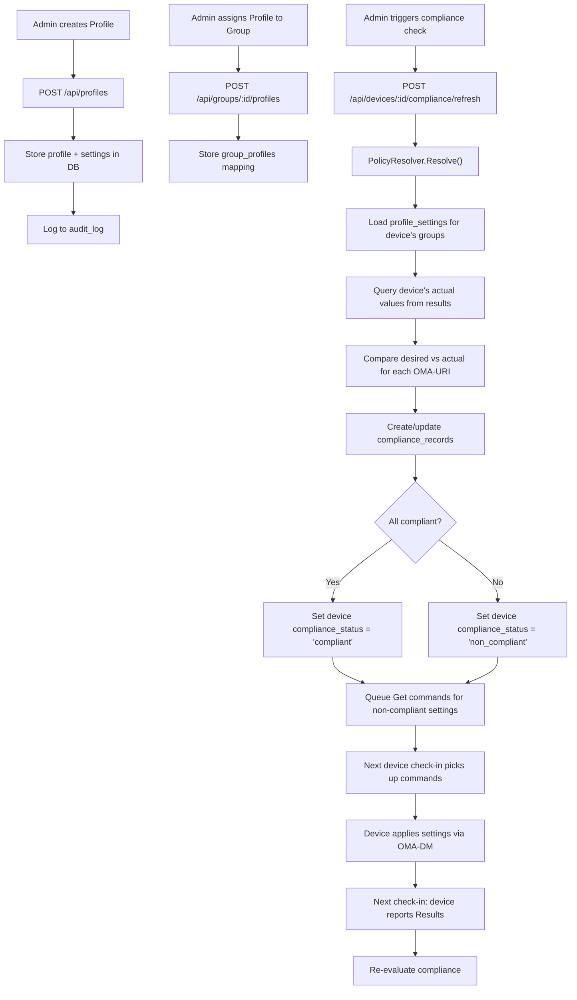
```mermaid
flowchart TD
    Admin["Admin creates Profile"] --> Create["POST /api/profiles"]
    Create --> StoreDB["Store profile + settings in DB"]
    StoreDB --> Audit["Log to audit_log"]

    Admin2["Admin assigns Profile to Group"] --> Assign["POST /api/groups/:id/profiles"]
    Assign --> StoreDB2["Store group_profiles mapping"]

    Admin3["Admin triggers compliance check"] --> Trigger["POST /api/devices/:id/compliance/refresh"]
    Trigger --> Resolve["PolicyResolver.Resolve()"]

    Resolve --> LoadProfile["Load profile_settings for device's groups"]
    LoadProfile --> LoadActual["Query device's actual values from results"]

    LoadActual --> Compare["Compare desired vs actual for each OMA-URI"]
    Compare --> Record["Create/update compliance_records"]

    Record --> Status{"All compliant?"}
    Status -->|Yes| MarkOK["Set device compliance_status = 'compliant'"]
    Status -->|No| MarkFAIL["Set device compliance_status = 'non_compliant'"]

    MarkOK --> QueueCmds["Queue Get commands for non-compliant settings"]
    MarkFAIL --> QueueCmds

    QueueCmds --> DeviceCheckin["Next device check-in picks up commands"]
    DeviceCheckin --> Apply["Device applies settings via OMA-DM"]
    Apply --> NextCheckin["Next check-in: device reports Results"]
    NextCheckin --> Recheck["Re-evaluate compliance"]
```

---

## 6. Authentication & Authorization

### 6.1 User Authentication Architecture

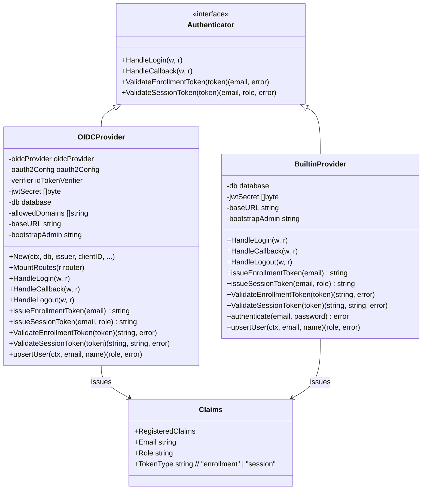
```mermaid
classDiagram
    class Authenticator {
        <<interface>>
        +HandleLogin(w, r)
        +HandleCallback(w, r)
        +ValidateEnrollmentToken(token) (email, error)
        +ValidateSessionToken(token) (email, role, error)
    }

    class OIDCProvider {
        -oidcProvider oidcProvider
        -oauth2Config oauth2Config
        -verifier idTokenVerifier
        -jwtSecret []byte
        -db database
        -allowedDomains []string
        -baseURL string
        -bootstrapAdmin string
        +New(ctx, db, issuer, clientID, ...)
        +MountRoutes(r router)
        +HandleLogin(w, r)
        +HandleCallback(w, r)
        +HandleLogout(w, r)
        +issueEnrollmentToken(email) string
        +issueSessionToken(email, role) string
        +ValidateEnrollmentToken(token) (string, error)
        +ValidateSessionToken(token) (string, string, error)
        +upsertUser(ctx, email, name) (role, error)
    }

    class BuiltinProvider {
        -db database
        -jwtSecret []byte
        -baseURL string
        -bootstrapAdmin string
        +HandleLogin(w, r)
        +HandleCallback(w, r)
        +HandleLogout(w, r)
        +issueEnrollmentToken(email) string
        +issueSessionToken(email, role) string
        +ValidateEnrollmentToken(token) (string, error)
        +ValidateSessionToken(token) (string, string, error)
        +authenticate(email, password) error
        +upsertUser(ctx, email, name) (role, error)
    }

    Authenticator <|-- OIDCProvider
    Authenticator <|-- BuiltinProvider

    class Claims {
        +RegisteredClaims
        +Email string
        +Role string
        +TokenType string  // "enrollment" | "session"
    }

    OIDCProvider --> Claims : issues
    BuiltinProvider --> Claims : issues
```

### 6.2 Token Types and Flows

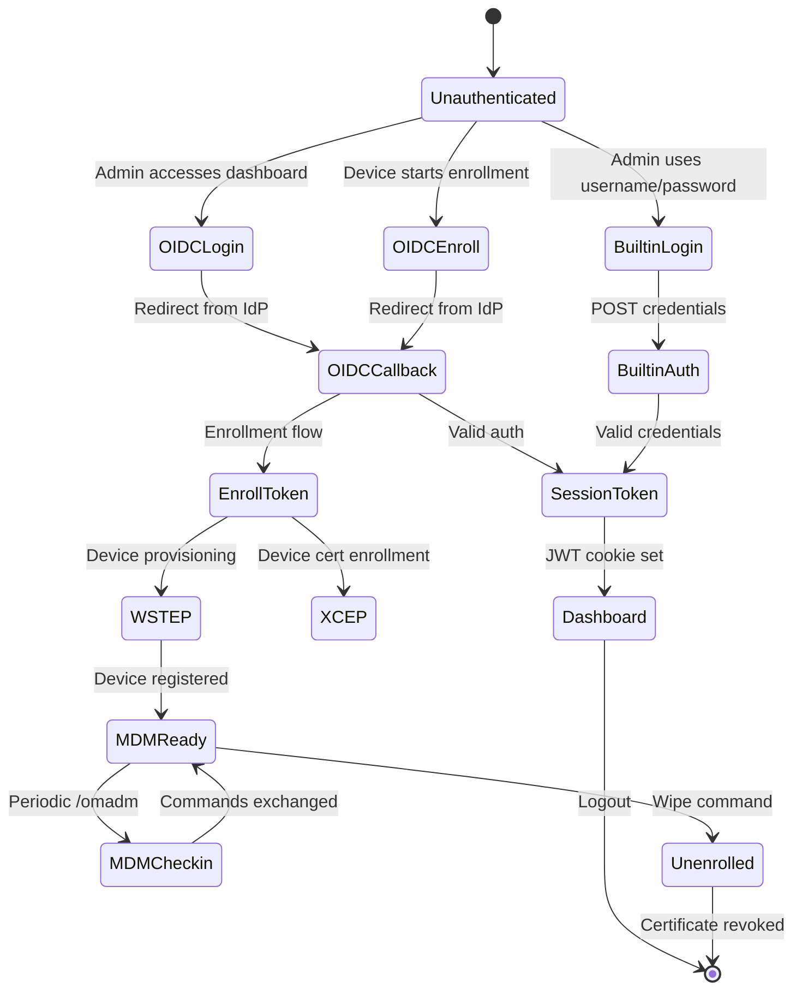
```mermaid
stateDiagram-v2
    [*] --> Unauthenticated

    Unauthenticated --> OIDCLogin: Admin accesses dashboard
    Unauthenticated --> BuiltinLogin: Admin uses username/password
    Unauthenticated --> OIDCEnroll: Device starts enrollment

    OIDCLogin --> OIDCCallback: Redirect from IdP
    BuiltinLogin --> BuiltinAuth: POST credentials
    OIDCEnroll --> OIDCCallback: Redirect from IdP

    OIDCCallback --> SessionToken: Valid auth
    BuiltinAuth --> SessionToken: Valid credentials
    OIDCCallback --> EnrollToken: Enrollment flow

    SessionToken --> Dashboard: JWT cookie set
    EnrollToken --> XCEP: Device cert enrollment
    EnrollToken --> WSTEP: Device provisioning

    WSTEP --> MDMReady: Device registered
    MDMReady --> MDMCheckin: Periodic /omadm
    MDMCheckin --> MDMReady: Commands exchanged

    Dashboard --> [*]: Logout
    MDMReady --> Unenrolled: Wipe command
    Unenrolled --> [*]: Certificate revoked
```

### 6.3 Device Authentication (mTLS)

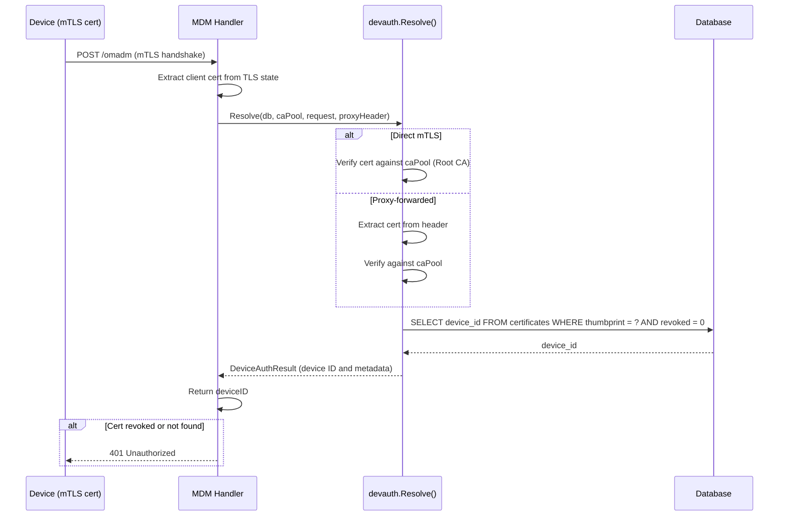
```mermaid
sequenceDiagram
    participant D as Device (mTLS cert)
    participant H as MDM Handler
    participant DA as devauth.Resolve()
    participant DB as Database

    D->>H: POST /omadm (mTLS handshake)
    H->>H: Extract client cert from TLS state
    H->>DA: Resolve(db, caPool, request, proxyHeader)

    alt Direct mTLS
        DA->>DA: Verify cert against caPool (Root CA)
    else Proxy-forwarded
        DA->>DA: Extract cert from header
        DA->>DA: Verify against caPool
    end

    DA->>DB: SELECT device_id FROM certificates WHERE thumbprint = ? AND revoked = 0
    DB-->>DA: device_id
    DA-->>H: DeviceAuthResult (device ID and metadata)
    H->>H: Return deviceID

    alt Cert revoked or not found
        H-->>D: 401 Unauthorized
    end
```

### 6.4 RBAC and Middleware Chain

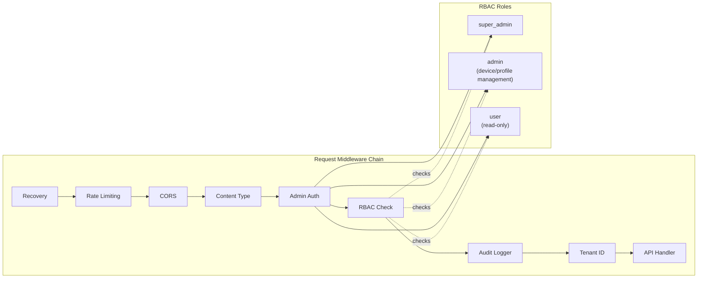
```mermaid
graph LR
    subgraph "Request Middleware Chain"
        M1["Recovery"] --> M2["Rate Limiting"]
        M2 --> M3["CORS"]
        M3 --> M4["Content Type"]
        M4 --> M5["Admin Auth<br/](session cookie)"]
        M5 --> M6["RBAC Check"]
        M6 --> M7["Audit Logger"]
        M7 --> M8["Tenant ID<br/](future)"]
        M8 --> Handler["API Handler"]
    end

    subgraph "RBAC Roles"
        R1["super_admin<br/](full access)"]
        R2["admin<br/>(device/profile management)"]
        R3["user<br/>(read-only)"]
    end

    M5 --> R1
    M5 --> R2
    M5 --> R3

    M6 -.checks.-> R1
    M6 -.checks.-> R2
    M6 -.checks.-> R3
```

---

## 7. State Machines

### 7.1 Device State Machine

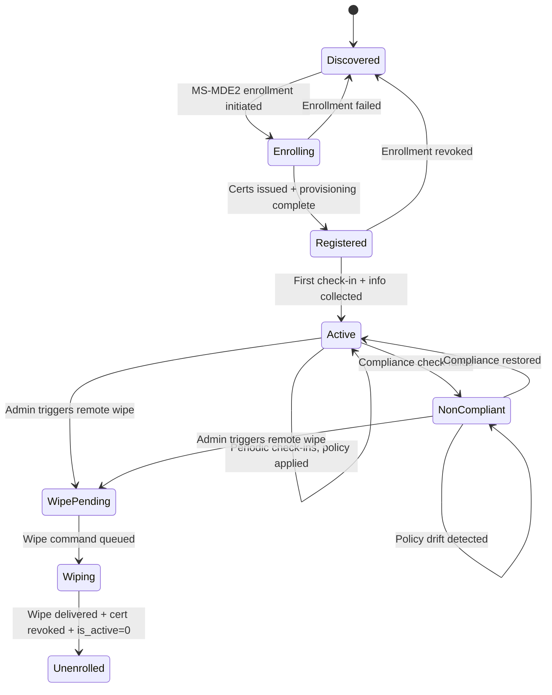
```mermaid
stateDiagram-v2
    [*] --> Discovered

    Discovered --> Enrolling: MS-MDE2 enrollment initiated
    Enrolling --> Registered: Certs issued + provisioning complete
    Registered --> Active: First check-in + info collected
    Active --> Active: Periodic check-ins, policy applied
    Active --> NonCompliant: Compliance check failed
    NonCompliant --> NonCompliant: Policy drift detected
    NonCompliant --> Active: Compliance restored

    Active --> WipePending: Admin triggers remote wipe
    NonCompliant --> WipePending: Admin triggers remote wipe

    WipePending --> Wiping: Wipe command queued
    Wiping --> Unenrolled: Wipe delivered + cert revoked + is_active=0

    Enrolling --> Discovered: Enrollment failed
    Registered --> Discovered: Enrollment revoked
```

### 7.2 Command Queue State Machine

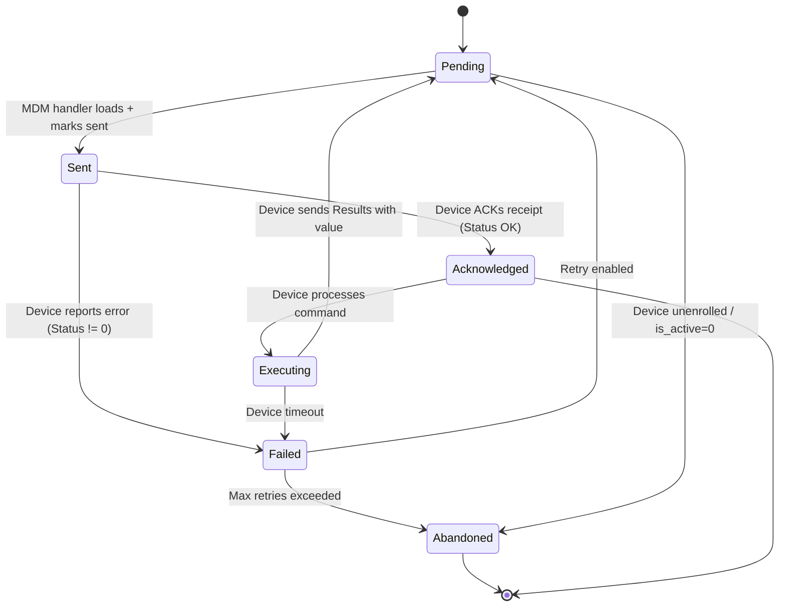
```mermaid
stateDiagram-v2
    [*] --> Pending

    Pending --> Sent: MDM handler loads + marks sent
    Sent --> Acknowledged: Device ACKs receipt (Status OK)
    Sent --> Failed: Device reports error (Status != 0)

    Acknowledged --> Executing: Device processes command
    Failed --> Pending: Retry enabled
    Failed --> Abandoned: Max retries exceeded

    Executing --> Pending: Device sends Results with value
    Executing --> Failed: Device timeout

    Pending --> Abandoned: Device unenrolled / is_active=0

    Abandoned --> [*]
    Acknowledged --> [*]
```

### 7.3 Profile Assignment State Machine

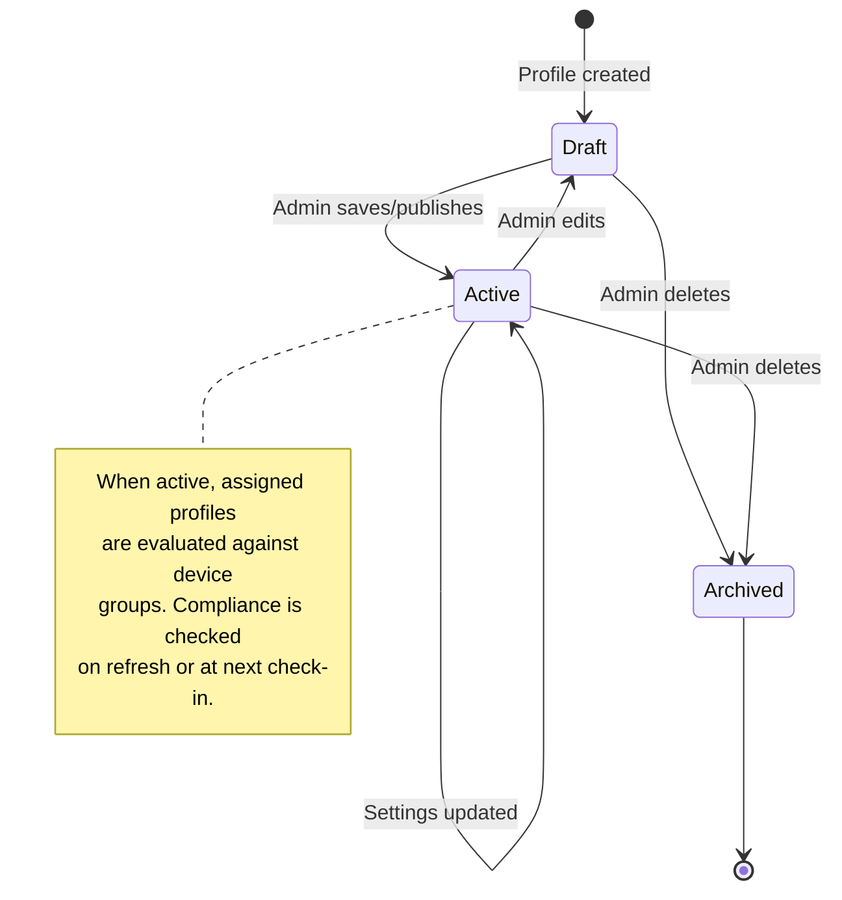
```mermaid
stateDiagram-v2
    [*] --> Draft: Profile created
    Draft --> Active: Admin saves/publishes
    Active --> Active: Settings updated
    Active --> Draft: Admin edits

    Draft --> Archived: Admin deletes
    Active --> Archived: Admin deletes

    Archived --> [*]

    note right of Active
        When active, assigned profiles
        are evaluated against device
        groups. Compliance is checked
        on refresh or at next check-in.
    end note
```

### 7.4 Certificate Lifecycle

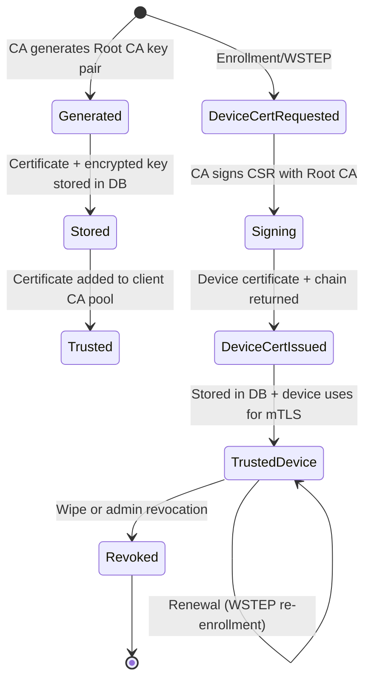
```mermaid
stateDiagram-v2
    [*] --> Generated: CA generates Root CA key pair
    Generated --> Stored: Certificate + encrypted key stored in DB
    Stored --> Trusted: Certificate added to client CA pool

    [*] --> DeviceCertRequested: Enrollment/WSTEP
    DeviceCertRequested --> Signing: CA signs CSR with Root CA
    Signing --> DeviceCertIssued: Device certificate + chain returned
    DeviceCertIssued --> TrustedDevice: Stored in DB + device uses for mTLS

    TrustedDevice --> Revoked: Wipe or admin revocation
    TrustedDevice --> TrustedDevice: Renewal (WSTEP re-enrollment)
    Revoked --> [*]
```

---

## 8. Data Model

### 8.1 Entity Relationship Diagram

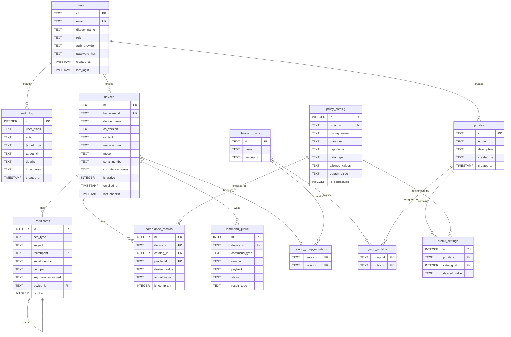
```mermaid
erDiagram
    users ||--o{ audit_log : creates
    users ||--o{ devices : enrolls
    users ||--o{ profiles : creates

    devices ||--o{ certificates : has
    devices ||--o{ compliance_records : has
    devices ||--o{ command_queue : waits
    devices }|--|| device_group_members : belongs_to

    device_groups ||--o{ device_group_members : contains
    device_groups ||--o{ group_profiles : assigns

    profiles ||--o{ profile_settings : contains
    profiles ||--o{ group_profiles : assigned_to

    policy_catalog ||--o{ profile_settings : referenced_by
    policy_catalog ||--o{ compliance_records : checked_in

    certificates ||--|| certificates : chains_to

    users {
        TEXT id PK
        TEXT email UK
        TEXT display_name
        TEXT role
        TEXT auth_provider
        TEXT password_hash
        TIMESTAMP created_at
        TIMESTAMP last_login
    }

    devices {
        TEXT id PK
        TEXT hardware_id UK
        TEXT device_name
        TEXT os_version
        TEXT os_build
        TEXT manufacturer
        TEXT model
        TEXT serial_number
        TEXT compliance_status
        INTEGER is_active
        TIMESTAMP enrolled_at
        TIMESTAMP last_checkin
    }

    policy_catalog {
        INTEGER id PK
        TEXT oma_uri UK
        TEXT display_name
        TEXT category
        TEXT csp_name
        TEXT data_type
        TEXT allowed_values
        TEXT default_value
        INTEGER is_deprecated
    }

    profiles {
        TEXT id PK
        TEXT name
        TEXT description
        TEXT created_by
        TIMESTAMP created_at
    }

    profile_settings {
        INTEGER id PK
        TEXT profile_id FK
        INTEGER catalog_id FK
        TEXT desired_value
    }

    device_groups {
        TEXT id PK
        TEXT name
        TEXT description
    }

    device_group_members {
        TEXT device_id FK
        TEXT group_id FK
    }

    group_profiles {
        TEXT group_id FK
        TEXT profile_id FK
    }

    command_queue {
        INTEGER id PK
        TEXT device_id FK
        TEXT command_type
        TEXT oma_uri
        TEXT payload
        TEXT status
        TEXT result_code
    }

    compliance_records {
        INTEGER id PK
        TEXT device_id FK
        INTEGER catalog_id FK
        TEXT profile_id FK
        TEXT desired_value
        TEXT actual_value
        INTEGER is_compliant
    }

    certificates {
        INTEGER id PK
        TEXT cert_type
        TEXT subject
        TEXT thumbprint UK
        TEXT serial_number
        TEXT cert_pem
        TEXT key_pem_encrypted
        TEXT device_id FK
        INTEGER revoked
    }

    audit_log {
        INTEGER id PK
        TEXT user_email
        TEXT action
        TEXT target_type
        TEXT target_id
        TEXT details
        TEXT ip_address
        TIMESTAMP created_at
    }
```

### 8.2 Key Indexes

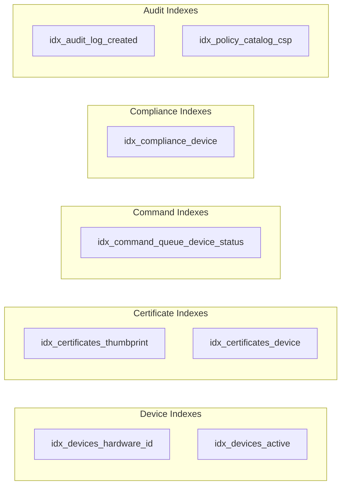
```mermaid
graph LR
    subgraph "Device Indexes"
        I1["idx_devices_hardware_id"]
        I2["idx_devices_active"]
    end

    subgraph "Certificate Indexes"
        I3["idx_certificates_thumbprint"]
        I4["idx_certificates_device"]
    end

    subgraph "Command Indexes"
        I5["idx_command_queue_device_status"]
    end

    subgraph "Compliance Indexes"
        I6["idx_compliance_device"]
    end

    subgraph "Audit Indexes"
        I7["idx_audit_log_created"]
        I8["idx_policy_catalog_csp"]
    end
```

---

## 9. API Surface

### 9.1 HTTP Routes

```mermaid
graph TB
    subgraph "Public Routes"
        P1["GET /"]
        P2["GET /auth/login"]
        P3["GET /auth/callback"]
        P4["POST /auth/login"]
        P5["POST /auth/logout"]
        P6["GET /enrollment/server/*"]
        P7["POST /omadm"]
    end

    subgraph "Admin API Routes<br/>(requires session auth)"
        A1["GET /api/devices"]
        A2["GET /api/devices/:id"]
        A3["DELETE /api/devices/:id"]
        A4["POST /api/devices/:id/wipe"]
        A5["POST /api/devices/:id/compliance/refresh"]
        A6["GET /api/profiles"]
        A7["POST /api/profiles"]
        A8["GET /api/profiles/:id"]
        A9["PUT /api/profiles/:id"]
        A10["DELETE /api/profiles/:id"]
        A11["GET /api/groups"]
        A12["POST /api/groups"]
        A13["GET /api/groups/:id"]
        A14["PUT /api/groups/:id"]
        A15["DELETE /api/groups/:id"]
        A16["GET /api/catalog"]
        A17["GET /api/compliance"]
        A18["GET /api/health"]
        A19["GET /api/metrics"]
    end

    subgraph "Internal/Web"
        W1["/* embedded SPA assets"]
    end

    P1 --> Public
    P2 --> Public
    P3 --> Public
    P4 --> Public
    P5 --> Public
    P6 --> Public
    P7 --> Public

    A1 --> Admin
    A2 --> Admin
    A3 --> Admin
    A4 --> Admin
    A5 --> Admin
    A6 --> Admin
    A7 --> Admin
    A8 --> Admin
    A9 --> Admin
    A10 --> Admin
    A11 --> Admin
    A12 --> Admin
    A13 --> Admin
    A14 --> Admin
    A15 --> Admin
    A16 --> Admin
    A17 --> Admin
    A18 --> Admin
    A19 --> Admin

    W1 --> Web
```

### 9.2 API Request Lifecycle

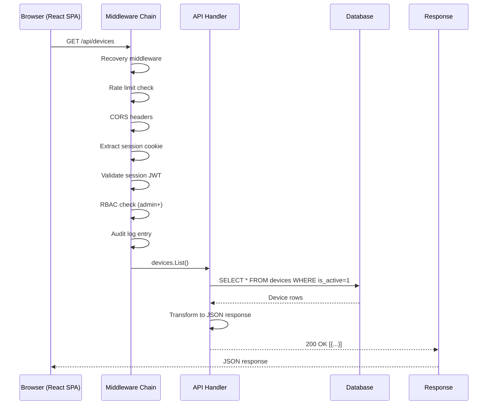
```mermaid
sequenceDiagram
    participant C as Browser (React SPA)
    participant M as Middleware Chain
    participant H as API Handler
    participant DB as Database
    participant A as Response

    C->>M: GET /api/devices
    M->>M: Recovery middleware
    M->>M: Rate limit check
    M->>M: CORS headers
    M->>M: Extract session cookie
    M->>M: Validate session JWT
    M->>M: RBAC check (admin+)
    M->>M: Audit log entry

    M->>H: devices.List()
    H->>DB: SELECT * FROM devices WHERE is_active=1
    DB-->>H: Device rows
    H->>H: Transform to JSON response
    H-->>A: 200 OK [{...}]

    A-->>C: JSON response
```

---

## 10. Session Management

### 10.1 In-Memory Device Session Store

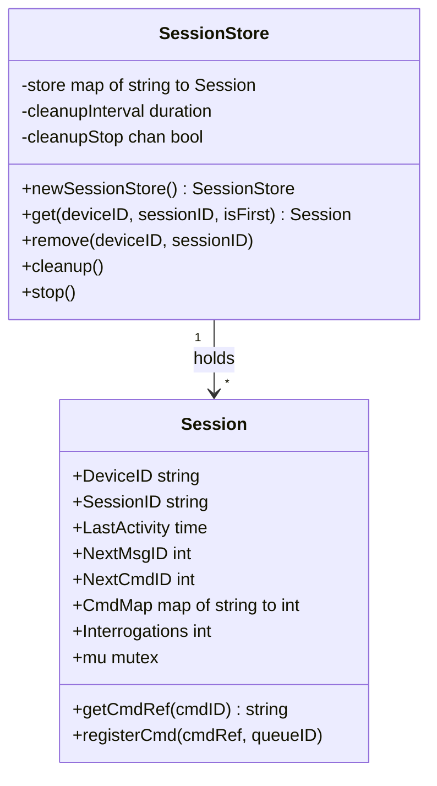
```mermaid
classDiagram
    class SessionStore {
        -store map of string to Session
        -cleanupInterval duration
        -cleanupStop chan bool
        +newSessionStore() SessionStore
        +get(deviceID, sessionID, isFirst) Session
        +remove(deviceID, sessionID)
        +cleanup()
        +stop()
    }

    class Session {
        +DeviceID string
        +SessionID string
        +LastActivity time
        +NextMsgID int
        +NextCmdID int
        +CmdMap map of string to int
        +Interrogations int
        +mu mutex
        +getCmdRef(cmdID) string
        +registerCmd(cmdRef, queueID)
    }

    SessionStore "1" --> "*" Session : holds
```

### 10.2 Session Lifecycle

```mermaid
stateDiagram-v2
    [*] --> Created: First check-in (Alert 1200)
    Created --> Active: Session established
    Active --> Active: Commands exchanged
    Active --> Evicted: TTL expiry (cleanup goroutine)
    Active --> Removed: All commands delivered

    Evicted --> [*]
    Removed --> [*]

    note right of Active
        Session persists across
        multiple TCP connections
        within the same OMA-DM
        session (same sessionID).
        Each request acquires the
        session mutex before
        processing.
    end note
```

---

## 11. TLS Configuration Modes

```mermaid
stateDiagram-v2
    [*] --> ConfigLoaded

    ConfigLoaded --> AutoTLS: tls.mode = "auto"
    ConfigLoaded --> ManualTLS: tls.mode = "manual"
    ConfigLoaded --> SelfSigned: tls.mode = "selfsigned"
    ConfigLoaded --> NoTLS: tls.mode = "none"

    AutoTLS --> ACMEChallenge: Port 80 HTTP-01
    ACMEChallenge --> HTTPS: Certificate obtained
    HTTPS --> CertRenewal: Let's Encrypt auto-renewal

    ManualTLS --> HTTPS: Load cert + key from disk

    SelfSigned --> HTTPS: Generate P-256 key pair
    HTTPS --> DevCache: Cache on disk for VM trust

    NoTLS --> HTTP: Plain HTTP
    HTTP --> ProxyCert: Accept forwarded certs
```

---

## 12. Policy Resolution Flow

```mermaid
flowchart TD
    subgraph Input["Input"]
        D["Device ID"]
        G["Fetch device groups"]
    end

    subgraph Resolution["Policy Resolution"]
        GP["Fetch group profiles"]
        PS["Fetch profile settings"]
        PC["Fetch policy catalog entries"]
        Resolve["Merge + deduplicate<br/>(last writer wins by OMA-URI)"]
    end

    subgraph Output["Output"]
        Final["Resolved policy map<br/>OMA-URI → desired_value"]
    end

    D --> G
    G --> GP
    GP --> PS
    PS --> PC
    PC --> Resolve
    Resolve --> Final

    style Input fill:#e1f5fe
    style Resolution fill:#fff3e0
    style Output fill:#e8f5e9
```

---

## 13. Key Design Decisions

| Decision | Rationale | Trade-off |
|----------|-----------|-----------|
| **Single Go binary** | Simplifies deployment (single container) | Monolithic, but manageable for this scope |
| **In-memory sessions** | Fast O(1) lookup, no Redis dependency | Sessions lost on restart; acceptable for stateless MDM |
| **mTLS device auth** | Strong authentication; no shared secrets | Certificate management complexity |
| **JWT session tokens** | Stateless validation, easy to revoke | Token revocation requires cookie invalidation |
| **Command queue in DB** | Durable, retryable, queryable | Polling-based; no push notifications |
| **SQLite + PostgreSQL** | Flexibility: dev (SQLite) vs prod (PostgreSQL) | Dual migration paths to maintain |
| **Fail-closed wipe** | Immediate security when device is lost | Device can't re-enroll without admin intervention |
| **DDF compiler as separate binary** | Separates concerns; can run ad-hoc | Extra deployment artifact |
| **Single-use enrollment tokens** | Prevents token replay attacks | Device must complete enrollment in one flow |